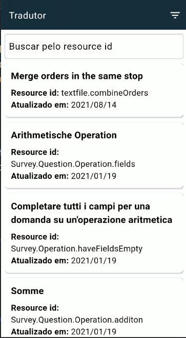
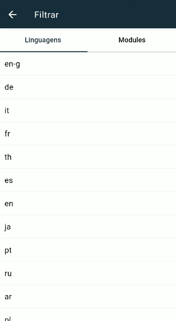
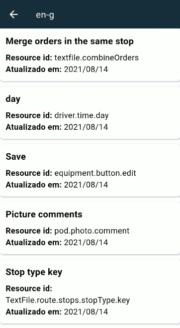

# Pixlog

## Screen

<div align="center">
  
	
	
	
</div>

---

### Arquitetura
- MVC

### Ramificações

- [/app](./lib/app/) -> Onde está sendo estruturado as features
  - [Home](./lib/app/resource/)
  - [Tela do filtro](./lib/app/filter/)
- [/helper](./lib/helper/) -> Onde está os métodos de ajuda para a aplicação.
  - [Api error](./lib/helper/api_error_helper.dart) -> Recebe um status code e retorna uma mensagem de erro
  - [Constants](./lib/helper/constants_helper.dart) -> Constantes global, como o link da API
  - [Enums](./lib/helper/enum_helper.dart) -> Constantes global, como o link da API
  - [Router](./lib/helper/router_helper.dart) -> Onde estão a chamada das rotas da aplicação
  - [Storage](./lib/helper/storage_helper.dart) -> Onde estão toda manipulação de inserção e busca do storage
- [/utils](./lib/utils/) -> Onde estão os components de ajuda para a aplicação.
  - [Theme](./lib/utils/theme/) -> Onde estão configurado o thema da aplicação e as cores
  - [Widget](./lib/utils/widget/) -> Onde estão os widgets de escopo global

---
### Fluxo básico das chamadas

```dart
//Toda vez que é chamado para buscar os recursos, há uma verificação no storage de primeiro acesso
Future<String?> isFirstTime() async {
	return await storage.getStringFromStorage(
		key: StorageKeysEnum.firstTime,
	);
}
```

```dart
//Se não é o primeiro acesso
if (firstTime == FisrtTimeEnum.no.name) {
	List<IntlResourceModel> list = [];
	
	if (_resources.isEmpty) {
		//Busca os recursos no storage
		list = await getResourcesFromStorage();
		_resources.addAll(list);
	}
	
	//Carrega a lista de linguagens
	getLanguages();
	//Carrega a lista de modulos
	getModules();

	return _resources;
}
```

```dart
//Sendo o primeiro acesso
if (firstTime == FisrtTimeEnum.no.name) {
	try {
		//Busca na API
		response = await http.get(Uri.parse(ConstantsHelper.apiUrl));
		//Converte a list
		(jsonDecode(response.body) as List).forEach((resource) {
			_resources.add(IntlResourceModel.fromMap(["resource"]));
		});

		if (response.statusCode == 200) {
			//Salva no storage
			await syncApiDataToStorage();
		} 
		else {
			//Caso haja erro na api é chamado e no _errorText para exibir na tela
			_errorText = apiError.getErrorByStatusCode(
			response.statusCode);
		}
		//Atualiza sobre o primeiro acesso do usuário
		await storage.saveStringToStorage(
			key: StorageKeysEnum.firstTime.name, 
			value: FisrtTimeEnum.no.name
		);
    } catch (error) {
      _errorText = error.toString();
    }
	//Atualiza a lista de linguagens
	getLanguages();
	//Atualiza a lista de modules
	getModules();
	notifyListeners();
	return _resources;
}
```

```dart
//Método que carrega a lista de linguagens
void getLanguages() {
	_languages.clear();
	groupedResourceListByLanguages = groupItemsByLanguage(_resources);
	//_languages é a lista de linguagens exibida no filtro
	_languages.addAll(groupedResourceListByLanguages.keys);
	notifyListeners();
}

//Método que carrega a lista de módulos
void getModules() {
	_modules.clear();
	//groupItemsByModules é quem agrupa a lista de resource pela linguagem
	groupedResourceListByModules = groupItemsByModules(_resources);
	//_modules é a lista de linguagens exibida no filtro
	_modules.addAll(groupedResourceListByModules.keys);
	notifyListeners();
}
```

```dart
//Método que agrupa as linguagens
Map groupItemsByLanguage(List<IntlResourceModel> items) {
	return groupBy(items, (item) => item.languageId);
}
//Método que agrupa os módulos
Map groupItemsByModules(List<IntlResourceModel> items) {
	return groupBy(items, (item) => item.resourceId);
}

//groupBy (Collection) -> https://pub.dev/packages/collection
```